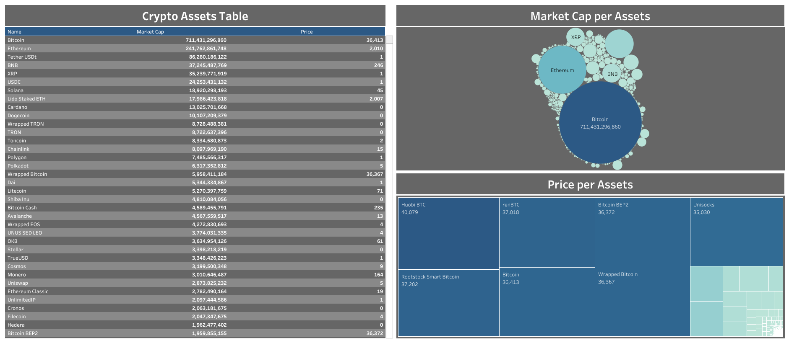

# CoinMarketCap Pipeline

&nbsp;&nbsp;&nbsp;&nbsp;&nbsp;&nbsp;An Data pipeline build with Airflow, AWS, Docker and Python, that retrieve data from an API and then store the data on a Data Lake.

## Description

### Objetive
&nbsp;&nbsp;&nbsp;&nbsp;&nbsp;&nbsp;The project will get data from CoinMarketCap API periodically (every five minute). Then the data will be transform into csv file before storing it to a Data Lake that is build with AWS S3 bucket. After successful storage of the data, I download it manually to create a Visualization in Tableau that will show the price and market cap of each crypto assets. Finally, after performing all those steps, the project objective is achieved.

### API
&nbsp;&nbsp;&nbsp;&nbsp;&nbsp;&nbsp;The api used in this project is from CoinMarketCap.

### Tools & Technologies
* Cloud - [AWS Cloud](https://aws.amazon.com/)
* Containerization - [Docker](https://www.docker.com/), [Docker Compose](https://docs.docker.com/compose/)
* Orchestration - [Airflow](https://airflow.apache.org/)
* Data Lake - [AWS S3](https://aws.amazon.com/s3/?nc2=h_ql_prod_st_s3)
* Data Visualization - [Tableau](https://www.tableau.com/)
* Language - [Python](https://www.python.org/)

### Architecture

## Code

### Initialization of the default arguments
    default_args = {
        'owner': 'jmo',
        'depends_on_past': False,
        'email': ['jmo@example.com'],
        'email_on_failure': False,
        'email_on_retry': False,
        'retries': 1,
        'start_date': days_ago(5)
    }

### DAG
    with DAG(
        'cmc_data',
        default_args = default_args,
        description = "ETL Coin Market Cap API",
        schedule_interval = timedelta(minutes=5),
        catchup = False,
        tags = ['jmo'],
        
    ) as dag:
        
        extract_load_cmc_data = PythonOperator(
            task_id = 'extract_load_cmc_data',
            python_callable = etl_data,
            dag = dag,
        )
        
        ready = EmptyOperator(
            task_id = 'ready'
        )
        
        extract_load_cmc_data >> ready

### Dag Directory Path
    dag_path = os.getcwd()

### Set Up Access Keys
    access_key = Variable.get("ACCESS_KEY");
    secret_access_key = Variable.get("SECRET_ACCESS_KEY");
    
    api_key = Variable.get("API_KEY")
        
    pro_api_url = Variable.get("PRO_API_URL")

### API Parameters & Headers
    parameters = {
        'start':'1',
        'limit':'5000',
        'market_cap_min':'500000',
        'convert':'USD',
        'sort_dir':'desc',
    }

    headers = {
        'Accepts': 'application/json',
        'X-CMC_PRO_API_KEY': api_key,
    }

### Extracting the Data
    response = session.get(pro_api_url, params=parameters)
    
    json_data = json.loads(response.text)

### Get the date time
    current_datetime = datetime.now().strftime("%Y-%m-%d_%H-%M-%S")
    
    str_current_datetime = str(current_datetime)   

### Set Up the file name
    file_name = "CMC_" + str_current_datetime + ".csv";
    
    file_path = 'cmc/' + file_name

### Set up the S3 bucket
    s3_bucket = 'my-crypto-data-lake' 
    
    s3_client = boto3.client('s3', aws_access_key_id=access_key, aws_secret_access_key=secret_access_key, region_name='us-east-1');

### Transforming the data
    raw_df = pd.DataFrame(json_data["data"])
    
    price_lst = []
    
    market_cap_lst = []
    
    for data in raw_df["quote"]:
        
        _data = data["USD"]
        
        price_lst.append(_data["price"])
        
        market_cap_lst.append(_data["market_cap"])
        
    clean_df = pd.DataFrame(columns=['Id','Name','Symbol','Slug','Last Updated','Price','Market Cap'])
    
    clean_df['Id'] = raw_df["id"]
    clean_df['Name'] = raw_df["name"]
    clean_df['Symbol'] = raw_df['symbol']
    clean_df['Slug'] = raw_df['slug']
    clean_df['Last Updated'] = raw_df['last_updated']
    clean_df['Price'] = price_lst
    clean_df['Market Cap'] = market_cap_lst

### Load Data to AWS S3 Bucket
    with io.StringIO() as csv_buffer:

        clean_df.to_csv(csv_buffer, index=False);
        
        response = s3_client.put_object(Bucket=s3_bucket, Key=file_path, Body=csv_buffer.getvalue())
    
    status = response.get("ResponseMetaData", {}).get("HTTPStatusCode");

    if status == 200:
        logging.info(f"Succesful S3 response. Status = {status}");
    else:
        logging.info(f"Unuccesful S3 response. Status = {status}");

## Data Visualization
